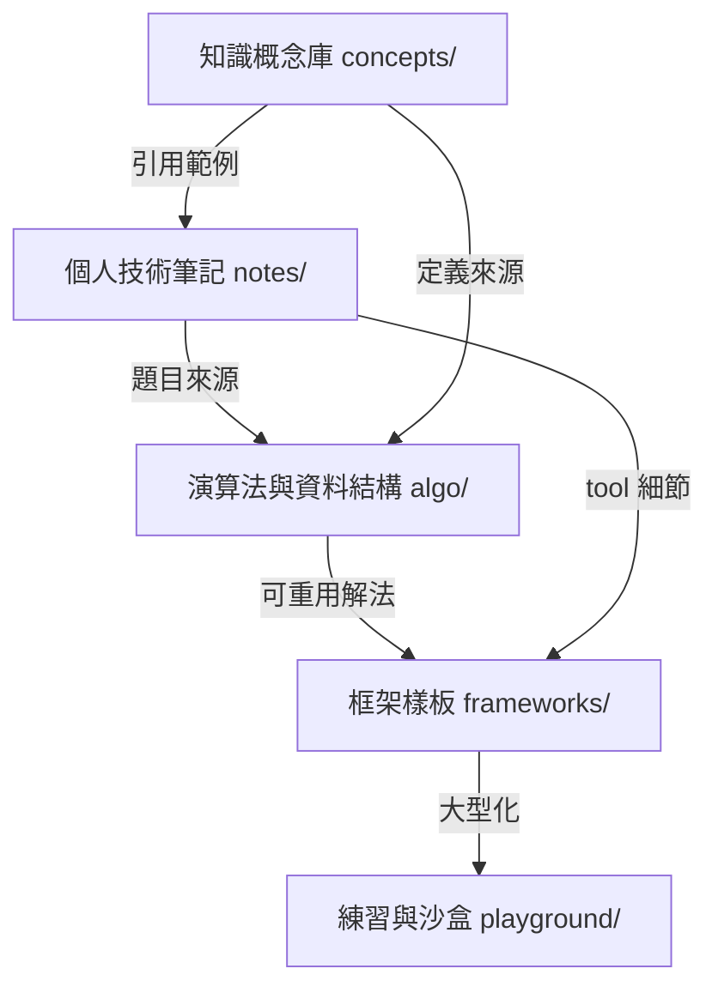

# codex-legacy

> 個人程式碼與知識彙整 monorepo — 從 [BizShuk](https://github.com/BizShuk) 旗下 11 個 GitHub repo 合併而成 (合併日期 2026-06-13)

這不是單一可執行的產品，而是「個人技術知識庫 + 可重用程式碼範本」的整合倉儲。內容橫跨 CS 概念筆記、面試準備、刷題練習、框架樣板與多語言沙盒，目的是讓單一 repo 內即可查找 / 複用過往的學習成果。

## 業務領域 (Business Domains)

本 repo 的「業務領域」對應到知識 / 程式資產分類，而非商業功能模組。

### 知識概念庫 (Knowledge Concepts)

CS 與軟工概念索引，作為其他分類的理論基礎。當需要查詢「某個 pattern / protocol / 演算法特性的定義」時的入口。

`領域流程 (Domain Flow):`

1. 進入 `concepts/<topic>/README.md` 取得該主題總覽
2. 從 `*.md` 摘要檔中取得關鍵字、圖示與交叉連結
3. 必要時回到 `notes/topic/cs_concept/` 取得個人化的補充範例

`核心實體 (Key Entities):` `Design Pattern`, `System Design`, `HTTP`, `Cryptographic`, `Database`, `ML`, `Security`, `Server`, `Math`, `Interview`

`相關處理器 (Related Handlers):` `concepts/design_pattern/Factory_method.md`, `concepts/system_design/cache.md`, `concepts/server/Microservice.md`, `concepts/cryptographic/`, `concepts/database/`, `concepts/security/`

---

### 個人技術筆記 (Personal Tech Notes)

日常工作中累積的語言 / 平台 / 主題筆記，依「domain / platform / topic / sport / talk」四象限分類。

`領域流程 (Domain Flow):`

1. 從 `notes/topic/<area>/` (Backend / DevOps / FrontEnd / Data / Security ...) 取得主題導向的整理
2. 從 `notes/platform/<tool>/` (ElasticSearch / Git / kubernetes / Node / VScode ...) 取得單一工具的 cheat sheet
3. 從 `notes/domain/<area>/` (CHC / Leadership / Management / Regulation / SoftwareEngineer / sport / talk) 取得非技術面的累積
4. 從 `notes/topic/cs_concept/` 連結回 `concepts/` 取得完整定義

`核心實體 (Key Entities):` `Backend`, `Frontend`, `DevOps`, `CHC`, `ElasticSearch`, `Git`, `Leadership`, `SoftwareEngineer`, `Kubernetes`, `Linux`

`相關處理器 (Related Handlers):` `notes/topic/Backend/`, `notes/topic/DevOps/`, `notes/platform/ElasticSearch/`, `notes/domain/SoftwareEngineer/`, `notes/todo.sh`

---

### 演算法與資料結構 (Algorithms & Data Structures)

刷題與 DS 練習集合；以 Go 為主軸 (`algo/go/`)，並有跨語言版本 (`algo/multi-lang/`) 用以對照 Python / JS / C++ 解法。

`領域流程 (Domain Flow):`

1. 從 `algo/go/README.md` 取得分類目錄 (basic-algo / basic-ds / interview / playground / questions / topic)
2. 進入 `algo/go/<topic>/` 檢視解題檔案與單元測試
3. 需要跨語言對照時切換到 `algo/multi-lang/leecode/` 或 `algo/`
4. 演算法特性或時間複雜度摘要回查 `algo/go/stack.md` / `TimeComplexityAnalysis.png`

`核心實體 (Key Entities):` `basic-algo`, `basic-ds`, `interview`, `playground`, `questions`, `topic`, `leecode`

`相關處理器 (Related Handlers):` `algo/go/main.go`, `algo/go/algo/`, `algo/go/basic-ds/`, `algo/go/interview/`, `algo/multi-lang/algo/`, `algo/multi-lang/leecode/`

---

### 框架樣板與設計模式 (Framework Templates & Patterns)

可直接 `import` / `fork` 重用的程式碼骨架與設計模式展示專案。

`領域流程 (Domain Flow):`

1. 評估使用情境 (Go 訊息匯流排、Express 起手式、Factory/Builder 範例、Rundeck 部署設定)
2. 將對應的 `frameworks/<project>/` 子目錄視為獨立子模組，各自維護 `go.mod` / `package.json` / 設定檔
3. 引用時直接 `import` Go 套件 (例如 `eventbus-go`) 或複製 JS 樣板
4. 需要看使用範例時讀 `frameworks/<project>/README.md` 與測試檔 (`*_test.go` / `.test.js`)

`核心實體 (Key Entities):` `eventbus-go` (Dispatcher / Event / EventService / SNSOption / SNSService / ExampleService), `express-boilerplate` (routes / lib / src / views), `pizza-patterns` (Factory / Builder), `rundeck-tomcat` (jobs.xml)

`相關處理器 (Related Handlers):` `frameworks/eventbus-go/Dispatcher.go`, `frameworks/eventbus-go/EventService.go`, `frameworks/eventbus-go/SNSService.go`, `frameworks/express-boilerplate/app.js`, `frameworks/express-boilerplate/webpack.config.js`, `frameworks/pizza-patterns/index.js`, `frameworks/rundeck-tomcat/jobs.xml`

---

### 練習與沙盒 (Playground & Sandbox)

多語言 / 多框架的練習與實驗空間，可隨意建立子專案而不影響主結構。

`領域流程 (Domain Flow):`

1. 進入 `playground/<lang>/` (python / go / js / c_cpp / java / lua / php / perl ...)
2. 在該語言子目錄下找到對應的練習腳本或小工具
3. 對需要長期保留的成品，從 `playground/` 晉升到 `frameworks/` 或獨立 repo
4. 已完成的迷你產品 (Express 短網址服務) 直接放在 `playground/<project>/`,標註為「歷史快照」

`核心實體 (Key Entities):` `fullstack-node` (public / src), `python` (basic.md / decorator.py / queue.py), `go` (goroutine / bit / list / tree / string / slice), `js`, `c_cpp`, `framework`, `slURL` (Express + React 15 URL 短網址服務, 2016 歷史快照)

`相關處理器 (Related Handlers):` `playground/fullstack-node/package.json`, `playground/python/decorator.py`, `playground/go/goroutine/`, `playground/fullstack-node/src/`, `playground/js/`, `playground/slURL/app.js`

> `playground/slURL/` 合併自 [BizShuk/slURL](https://github.com/BizShuk/slURL),原始 `.gitignore` 刻意排除 `lib/`、`setting.js`、`*.sql` (DB 連線設定與 short-domain 設定),若要實際運行需自行補上 `lib/database.js`、`lib/err.js`、`setting.js`。套件 (React 15 / Webpack 1 / Babel 6) 保留 2016 年原貌。

---

## 領域關聯 (Domain Relationships)

- `concepts/` 提供「為什麼這樣設計」, `frameworks/` 提供「可直接拿來用」, 兩者互為引用
- `algo/` 的題目靈感常源自 `notes/topic/interview/` 與 `concepts/interview/`
- `playground/` 是新點子的試作區, 成熟後可上移至 `frameworks/`
- `notes/` 透過 `todo.sh` 與多份 `*.todo` 串接「待辦」與「知識待補」

## 使用方式 (Usage)

> 這個 monorepo 主要供「查詢 / 引用」而非「單鍵 build」, 沒有統一的 `Makefile` / root `package.json`。

| 想要做什麼                  | 入口                                                            |
| --------------------------- | --------------------------------------------------------------- |
| 查 CS 概念 / 設計模式       | `concepts/<topic>/README.md`                                    |
| 查某語言 / 工具 cheat sheet | `notes/platform/<tool>/`                                        |
| 引用 Go eventbus 函式庫     | `cd frameworks/eventbus-go && go test ./...`                    |
| 跑 Express 樣板             | `cd frameworks/express-boilerplate && npm install && npm start` |
| 看 Factory/Builder 範例     | `cd frameworks/pizza-patterns && node index.js`                 |
| 找 Go 演算法題              | `algo/go/<topic>/`                                              |
| 找跨語言 LeetCode 解        | `algo/multi-lang/leecode/`                                      |
| 跑 Python 練習              | `cd playground/python && python3 <file>.py`                     |

## 改善建議 (Improvement Suggestions)

- [ ] **統一語言版本管理**: `algo/go/go.mod` 與 `notes/go.mod` 各自獨立, 但 `frameworks/eventbus-go/go.mod` 與專案內 `go.sum` 版本可能漂移; 建議建立 root `go.work` 統一管理 Go 子模組
- [ ] **建立跨分類索引表**: `README.md` 內的分類表只列出「來源 repo」, 沒有「關鍵字 → 檔案路徑」對照; 建議在 `README.md` 補一個「關鍵字索引」段落, 串接 `concepts/`、`notes/`、`algo/`、`playground/`
- [ ] **algo 模組化**: `algo/go/main.go` 目前是手動切換註解呼叫不同 package, 應改為 `cmd/<topic>/main.go` 子命令或 `go test ./...` 進入點, 避免誤編譯
- [ ] **playground 結構過深**: `playground/python/`、`playground/go/` 等直接放腳本而非子目錄, 大型語言子目錄與小型子目錄混雜; 建議為每個語言統一子目錄 (e.g. `playground/python/<project>/`)
- [ ] **設計模式範例單薄**: `frameworks/pizza-patterns/` 只有 `index.js` 與 `lib/`, 缺乏對應的測試與 UML 圖; 建議補上單元測試與 `docs/` 內的循序圖
- [ ] **缺少 CI 與 lint 設定**: 多個子專案 (Go / JS / Python) 都沒有 `.github/workflows/` 或 root lint 設定, 合併後未整合; 建議加入 `markdownlint` (已有 skill) 與 `golangci-lint` 設定
- [ ] **README.todo 應整合或封存**: `README.todo` 26 KB 大小且為個人規劃草稿, 與正式 `README.md` 共存易混淆; 建議將穩定段落併入 `README.md`, 真正待辦移入 `notes/TODO*.md`
